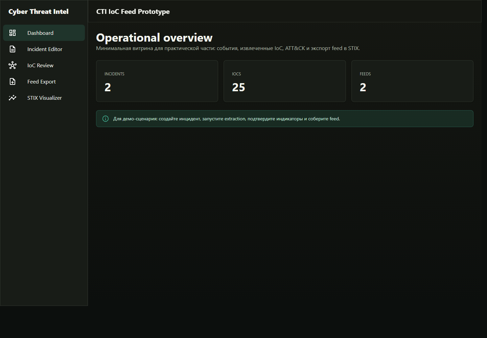
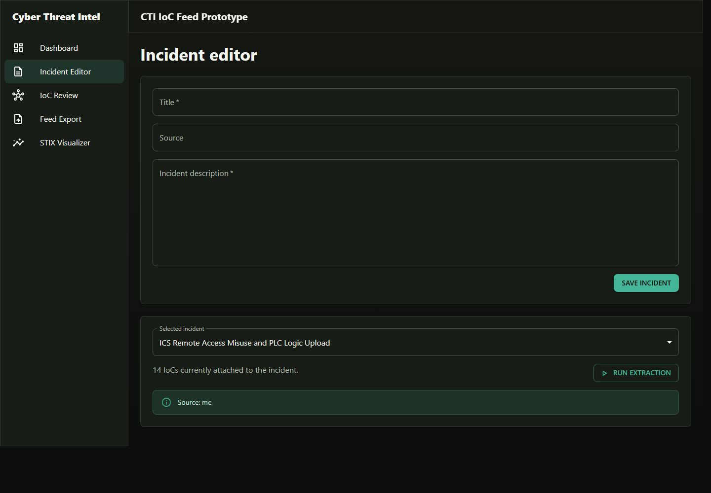
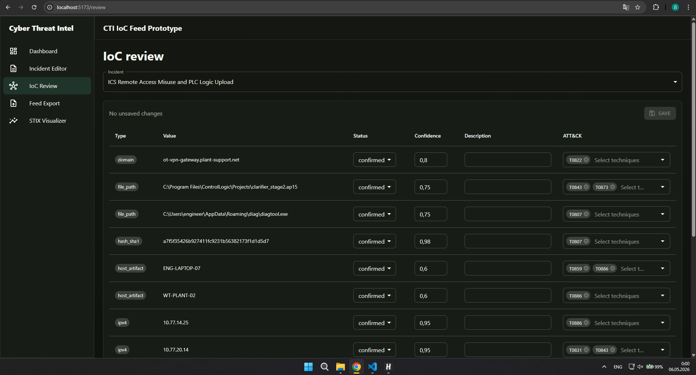
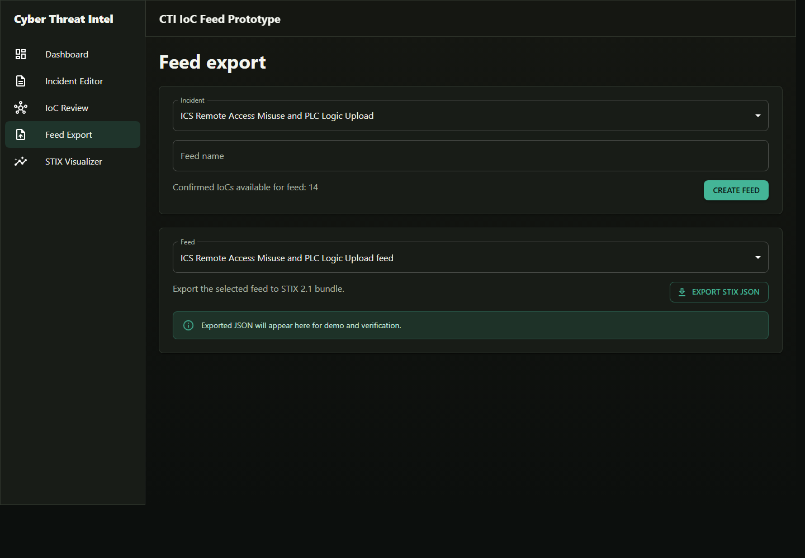
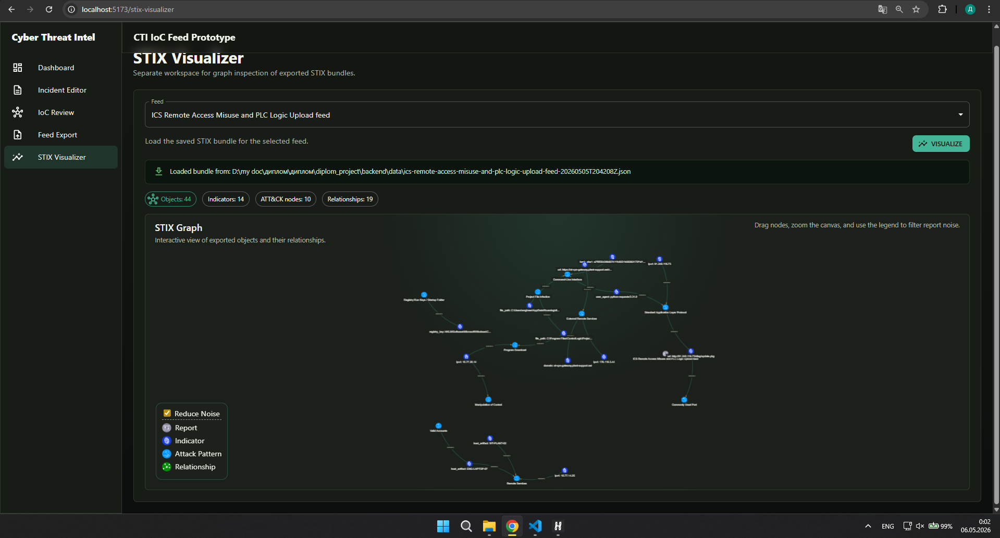

# CTI IoC Feed Prototype

Веб-система для обработки описаний киберинцидентов, извлечения IoC, ручной проверки индикаторов, привязки к MITRE ATT&CK и экспорта подтвержденных индикаторов в STIX 2.1 JSON.

## Возможности

- создание карточек инцидентов по текстовому описанию;
- автоматическое извлечение IoC из текста инцидента;
- ручная проверка статуса, уверенности и описания индикаторов;
- привязка индикаторов к техникам MITRE ATT&CK;
- формирование feed из подтвержденных IoC;
- экспорт feed в STIX 2.1 JSON;
- просмотр экспортированного STIX bundle в отдельном визуализаторе.

## Структура проекта

```text
.
├── backend/                # FastAPI backend, SQLite, STIX export
│   ├── app/                # API, модели, схемы, сервисы
│   ├── data/               # локальные данные и ATT&CK JSON
│   └── requirements.txt    # Python-зависимости
├── frontend/               # React + Vite frontend
│   ├── src/
│   └── package.json
├── docs/                   # тестовые отчеты и скриншоты
└── README.md
```

## Данные MITRE ATT&CK

В `backend/data` должны храниться три STIX-файла MITRE ATT&CK:

- `enterprise-attack.json`
- `ics-attack.json`
- `mobile-attack.json`

При запуске backend читает эти файлы и заполняет справочник ATT&CK техник в SQLite. Если файлы отсутствуют, система использует небольшой встроенный fallback-набор техник.

Остальные файлы в `backend/data` являются локальными runtime-артефактами и не должны попадать в Git: `cti.db`, экспортированные STIX JSON и временные файлы.

## Требования

- Python 3.11 или новее;
- Node.js 20 или новее;
- npm;
- Git.

Проверка версий:

```bash
python --version
node --version
npm --version
```

## Запуск на Windows

Откройте PowerShell в корне проекта.

### 1. Backend

```powershell
cd backend
python -m venv .venv
.\.venv\Scripts\Activate.ps1
python -m pip install -r requirements.txt
python -m uvicorn app.main:app --reload --host 127.0.0.1 --port 8000
```

Если PowerShell блокирует активацию виртуального окружения, выполните:

```powershell
Set-ExecutionPolicy -Scope Process -ExecutionPolicy Bypass
.\.venv\Scripts\Activate.ps1
```

Проверка backend:

```powershell
Invoke-RestMethod http://127.0.0.1:8000/health
```

Ожидаемый ответ:

```json
{
  "status": "ok"
}
```

### 2. Frontend

Откройте второй PowerShell в корне проекта.

```powershell
cd frontend
npm install
npm run dev
```

После запуска откройте:

```text
http://127.0.0.1:5173
```

Frontend проксирует `/api` и `/health` на backend `http://127.0.0.1:8000`.

## Запуск на Linux/macOS

Откройте терминал в корне проекта.

### 1. Backend

```bash
cd backend
python3 -m venv .venv
source .venv/bin/activate
python -m pip install -r requirements.txt
python -m uvicorn app.main:app --reload --host 127.0.0.1 --port 8000
```

Проверка backend:

```bash
curl http://127.0.0.1:8000/health
```

Ожидаемый ответ:

```json
{"status":"ok"}
```

### 2. Frontend

Откройте второй терминал в корне проекта.

```bash
cd frontend
npm install
npm run dev
```

После запуска откройте:

```text
http://127.0.0.1:5173
```

## Как работать в системе

### 1. Dashboard

На главной странице отображается краткая статистика: количество инцидентов, IoC и feed.



### 2. Создание инцидента

Откройте `Incident Editor`, заполните:

- `Title` - название инцидента;
- `Source` - источник отчета или заметки;
- `Incident description` - текст расследования, письмо, отчет SOC или аналитическое описание.

Нажмите `Save incident`.



### 3. Извлечение IoC

В блоке выбора инцидента выберите нужную запись и нажмите `Run extraction`. Backend извлечет домены, URL, IP-адреса, хэши, пути файлов, registry keys, user-agent и host artifacts, которые распознает текущий extractor.

### 4. Проверка IoC

Перейдите в `IoC Review`. Для каждого индикатора можно изменить:

- `Status`: `candidate`, `confirmed`, `rejected`;
- `Confidence`: значение уверенности от `0` до `1`;
- `Description`: аналитический комментарий;
- `ATT&CK`: одну или несколько техник MITRE ATT&CK.

Для попадания индикатора в feed установите статус `confirmed`, затем нажмите `Save`.



### 5. Создание feed

Перейдите в `Feed Export`, выберите инцидент, задайте `Feed name` и нажмите `Create feed`. В feed попадут подтвержденные IoC выбранного инцидента.



### 6. Экспорт STIX JSON

На странице `Feed Export` выберите созданный feed и нажмите `Export STIX JSON`. Backend сформирует STIX 2.1 bundle, сохранит JSON в `backend/data` и покажет содержимое bundle на странице.

Экспортированные JSON-файлы игнорируются Git, потому что это локальные результаты работы системы.

### 7. Визуализация STIX

Перейдите в `STIX Visualizer`, выберите feed с уже выполненным экспортом и нажмите `Visualize`. Система загрузит сохраненный STIX bundle и отобразит граф объектов, индикаторов, ATT&CK nodes и relationships.



## Проверка Git-правил для `backend/data`

Файлы ATT&CK должны отслеживаться Git, а остальные файлы в `backend/data` должны игнорироваться.

Проверка игнорирования SQLite-базы:

```bash
git check-ignore -v backend/data/cti.db
```

Команда должна показать правило из `.gitignore`.

Проверка ATT&CK JSON:

```bash
git check-ignore -v backend/data/enterprise-attack.json
git check-ignore -v backend/data/ics-attack.json
git check-ignore -v backend/data/mobile-attack.json
```

Для этих трех файлов команда не должна выводить ignore-правило.

## Типовые проблемы

### Backend не запускается: `No module named uvicorn`

Установите зависимости из активированного виртуального окружения:

```bash
python -m pip install -r requirements.txt
```

### Frontend не открывается

Проверьте, что dev server запущен из папки `frontend`:

```bash
npm run dev
```

Откройте URL, который Vite выводит в терминале. По умолчанию это `http://127.0.0.1:5173`.

### Frontend показывает ошибку загрузки данных

Проверьте, что backend работает:

```bash
curl http://127.0.0.1:8000/health
```

На Windows можно использовать:

```powershell
Invoke-RestMethod http://127.0.0.1:8000/health
```

### ATT&CK техники не появились

Проверьте, что файлы `enterprise-attack.json`, `ics-attack.json` и `mobile-attack.json` находятся в `backend/data`. Затем перезапустите backend.

### STIX JSON не появился в Git

Это ожидаемое поведение. Экспортированные JSON-файлы в `backend/data` игнорируются, потому что они создаются локально при работе системы.
